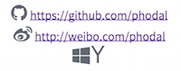

#Showdown Font Awesome Plugin

##Usage

    var converter = new showdown.Converter({ extensions: ['icons'] });
    var result = converter.makeHtml(
            '<icon-github> [https://github.com/phodal](https://github.com/phodal) ' +
            '<icon-weibo> [http://weibo.com/phodal](http://weibo.com/phodal) ' +
            '<icon-windows><icon-yahoo><icon-tencent-weibo>'
    );
    document.getElementById('show').innerHTML = result;
    
##ScreenShot    

